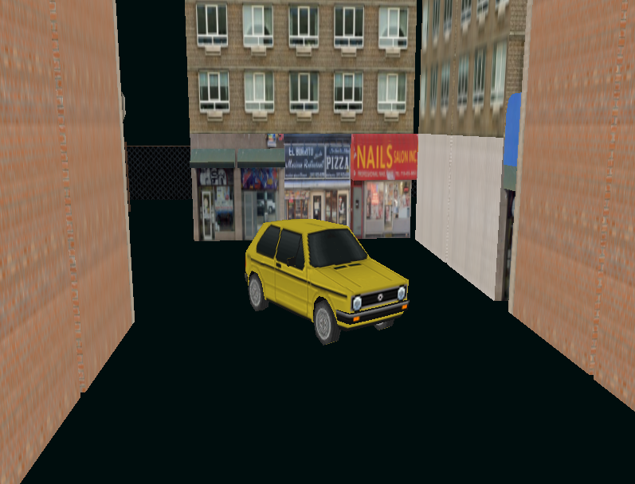

# XTRA CHEEZ
_Miniature PSX-style video game written in Rust using OpenGL in an ECS architecture._

## What is this? 
The purpose of this project was for me to learn more about OpenGL, Rust and ECS. Suffice it to say that with the
projects current standing I would consider it a success. As a game, however, it is utter garbage. The plan is to add a
start and an end to the "game" and then add any niceties whenever the mood strikes. As such, it is expected that this 
project is left unattended and uncared-for for long periods of time.

## Running
There isn't any real special sauce to building and running this compared to any other Rust project with Cargo. Just run 
```cargo run``` and an SDL2 window should open with the game running inside. Do make sure that SDL2.dll exists within
the project directory though.



## What next?
Below is a list of possible improvements that I might look into adding or fixing in the future. This project is not 
open for contributions, hence this list serves more as a reminder for myself for whenever I decide to work on it again. 
That said, if you for whatever reason would like to contribute with an item to the list then by all means.

* Dynamically add road models to empty tiles
* Make player rotation physics-based to avoid the current collision bug with rotations